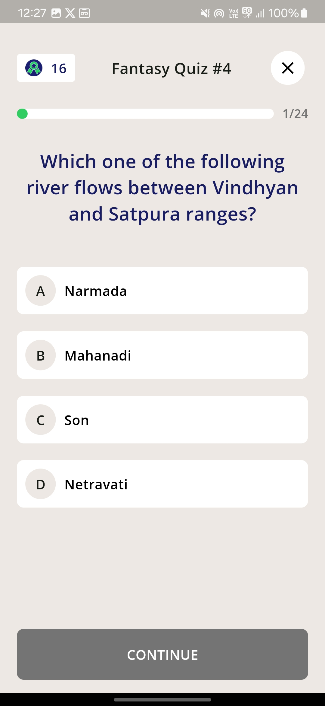
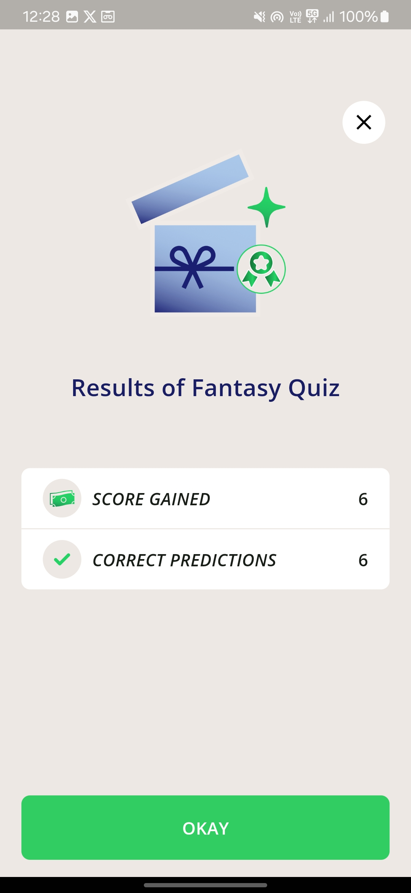

# Quiz Application

This is a Flutter-based quiz application built to fetch quiz questions from a remote API,
store them locally, and display them to users in an interactive interface. The app calculates and
displays the total score at the end of the quiz and handles errors gracefully.

# Screenshots

<div>
   
   
   
</div>

## Project Setup
Follow these steps to run the project locally:

1. **Clone the repository**:

   ```bash
   git clone <repository_url>
   cd <repository_folder>

2. **Install dependencies**:

   ```bash
   flutter pub get

3. **Run the application**:

   ```bash
   flutter run

4.  **Execute tests**:

   ```bash
   flutter test
